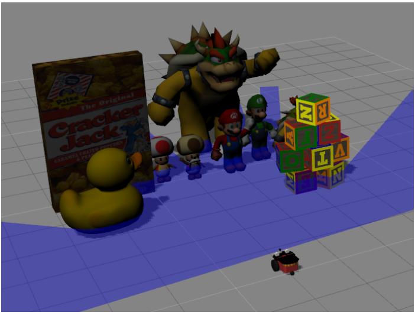
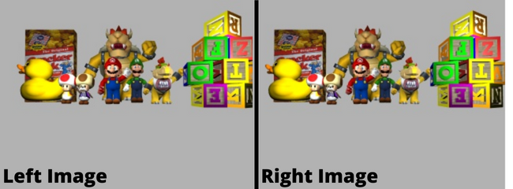
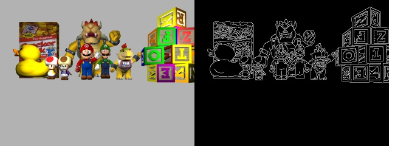
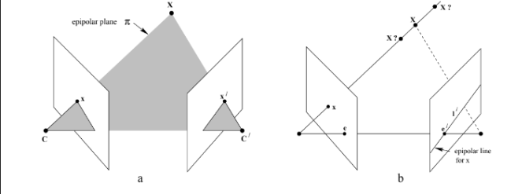
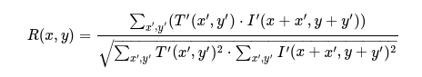
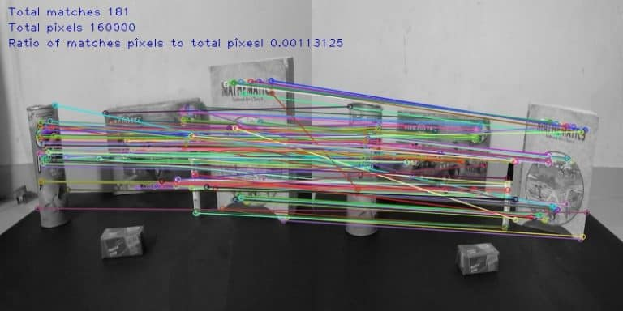
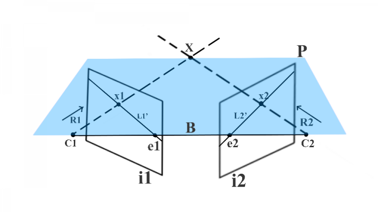
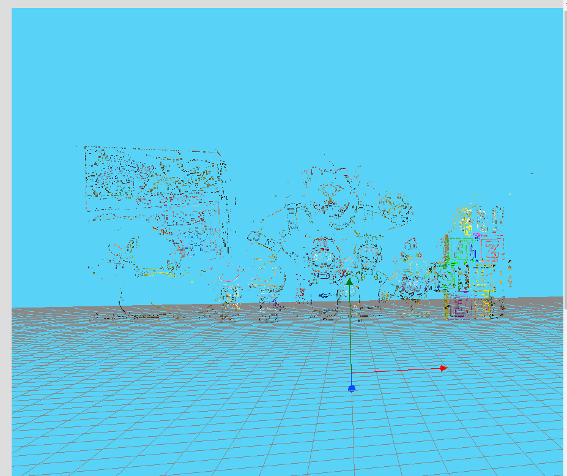
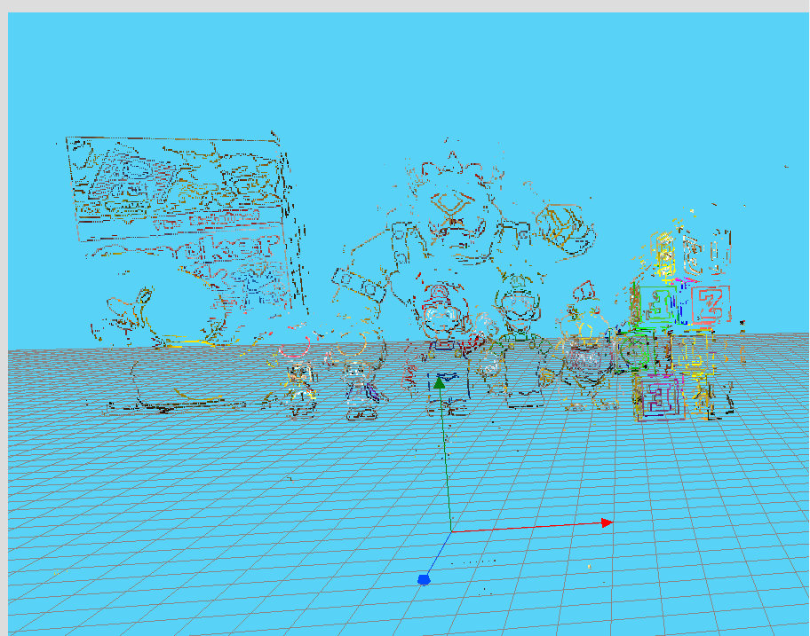
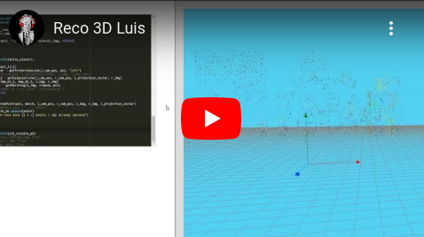

# 3D_reconstruction
[Unibotics](https://unibotics.org) exercice [3d-reconstruction](https://unibotics.org/academy/exercise/3d_reconstruction/)

#### 👨‍🎓 This project was carried out during my master's degree in computer vision at URJC - Madrid 

Here you will find my solution to the "[3d-reconstruction](https://unibotics.org/academy/exercise/3d_reconstruction/)" exercise.

The goal of this one is to reconstruct a 3d scene with only two cameras observing the scene at two different positions.

## Website

You can find more information about my project here : [My website](https://poubelle2604.wixsite.com/luis-2022-robotica/3d-reconstruction)

## Goals

- Reconstruct a 3d scene with only two cameras

## Requirements

* Python 3.7+
* [Unibotics](https://unibotics.org) account
* Go to [this website](https://unibotics.org/academy/exercise/3d_reconstruction/)


* numpy == 1.21
* opencv_python == 4.5.5
* GUI == 0.0.1 (custom library)
* HAL == 0.0.3 (custom library)


How to install all the requirements (GUI and HAL) :
```bash
$ docker pull jderobot/robotics-academy:latest
```
```bash
$ docker run --rm -it -p 8000:8000 -p 2303:2303 -p 1905:1905 -p 8765:8765 -p 6080:6080 -p 1108:1108 jderobot/robotics-academy
```
Wait for the Connect button to turn green and display “Connected”. Click on the “Launch” button and wait for some time until an alert appears with the message Connection Established and button displays “Ready”.

###### For more information : [website](https://unibotics.org/academy/exercise/3d_reconstruction/) (in instructions section). 

## Usage

Copy and paste ```src/reconstruction_3d.py``` in the code section of the website exercise.

## Project details

We are going to solve this exercise using the Unibotics website (unibotics.org).
This gives us access to a code editor and a simulator where we can see the result of it.
You can find the exercise (link below).

The goal of this exercise is to reconstruct a 3d scene (represented by objects such as a Mario, Bowser, a duck, cubes ...) with only two cameras observing the scene at two different positions.

There is two important aspects of robotics which are: the robustness of the program and its execution time (should be real time).

<p align="center">
  
*This image is the 3d scene that we will try to reconstruct*
</p>


## My solution

To reconstruct this 3d scene we will use epipolar lines and strereo reconstruction.
The resolution is divided in 5 parts which are : 
 

- 1) Detection of the feature points from the left camera (with Canny edge detector).
(Optional) Reduce the number of the feature points find by the canny edge detector.
- 2) Calculate the back projection ray of every feature point.
- 3) Calculate the epipolar line for every feature point.
- 4) Find the corresponding pixels of the left camera in the right camera for every point (thanks to the epipolar line)
- 5) Calculate the 3D position of every point using triangulation.


### 0. The data provided

In order to solve this problem we have access to two cameras that observe the scene from two different locations.

Here are the images from the two cameras :

<p align="center">
  
*Left and right image of the 3d scene*
</p>


### 1. Features points

To start the reconstruction we have to choose which point will be reconstructed.
For this we will choose feature points : points that are part of edges.
We will detect these points with the Canny edge detector.

The Canny edge detector is an edge detection operator that uses a multi-stage algorithm to detect a wide range of edges in images.
It was developed by John F. Canny in 1986.

The result of the Canny algorithm on the provenance image of the left camera: 

<p align="center">
  
*Result of the Canny algorithm on the left image*
</p>


### (Optional) Reducing feature points

If too many feature points are detected by the Canny algorithm, it is possible to reduce them.
Indeed, with the reduceNumberOfPoints() function it is possible to reduce the number of feature points.

That will reduce the amount of data to be processed, the result will be less qualitative, but it will take less time to execute (proportional to the amount of points removed).

### 2. Back projection ray

The backprojection ray is a line that will represent all the positions of the point in the scene (3D).
This line passes through the optical centre (left camera position) and through the coordinates of the point on the image.
The aim is to calculate all the back projection rays for all the points in order to find the 3D position of each of them.

<p align="center">
  
*The back projection line is represented by the "O, P(X,Y,Z)" line*
</p>


### 3. Epipolar line

The epipolar line is the one that will allow us to find the corresponding point in the image from left to right.
Since our two cameras have the same vertical coordinates, we only need to draw a horizontal line in the right image with the same y coordinates as the left image point.

<p align="center">
  
*Epipolar line explained*
</p>


### 4. Find corresponding point

To find the corresponding points we will use the cv2.matchTemplate() function of openCV by searching in the area drawn by the epipolar line.
The function slides through image, compares the overlapped patches of size w×h against the template.
I used the cv2.TM_CCOEFF_NORMED method (shifted mean cross-correlation).

<p align="center">
  
*Shifted mean cross-correlation, used in the matchTemplate() function*
</p>


<p align="center">
  
*Exemple of the matchTemplate() function*
</p>

### 5. Triangulation

Once we have obtained the "backprojection ray" of the point in the right image and its corresponding point (in the left image), we need only look for where these two lines intersect.
This intersection (or where the spacing between the two lines is less) will be the 3D position of our point in the scene.

<p align="center">
  
*X point will be the 3D point in the scene*
</p>

### 6. Results

I have achieved different results, one with 10,000 feature points and one with 18,000 feature points.
We can see in the results that the more texture an object has the better it will be represented in 3D (for example the duck doesn't have much texture and it doesn't show much in the reconstruction).
This is due to the result of the canny edge detector which takes into account the edges and therefore the texture.

<p align="center">
  
*Result with 10.000 features points*
</p>

<p align="center">
  
*Result with 18.300 features points*
</p>


[](https://www.youtube.com/watch?v=jVXUgUmOpTs&ab_channel=Luis)

## Structure

    .
    ├── imgs
    │    ├── 10K.png
    │    ├── 18k3.png
    │    ├── 3d_reconstruction.png
    │    ├── canny.png
    │    ├── explication_1.jpg
    │    ├── explication_2.png
    │    ├── explication_3.webp
    │    ├── formula.png
    │    ├── left_image.png
    │    ├── match.jpg
    │    └── youtube.png
    ├── README.md
    └── src
        └── reconstruction_3d.py


## Authors

* **Luis Rosario** - *Member 1* - [Luisrosario2604](https://github.com/Luisrosario2604)